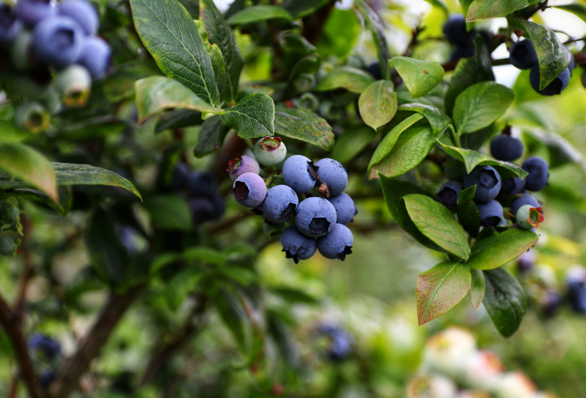
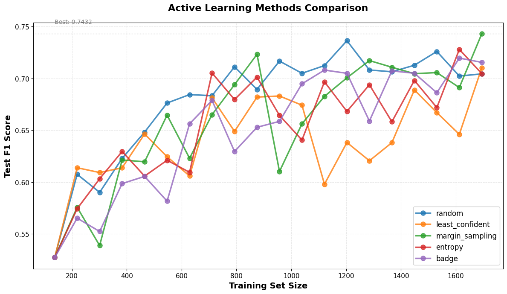

# Active Learning

<!--

Excalidraw:

```bash
# Log in/out to Docker Hub
docker logout
docker login

# Pull the official image (first time)
docker pull excalidraw/excalidraw

# Start app
docker run --rm -dit --name excalidraw -p 5001:80 excalidraw/excalidraw:latest
# Open browser at http://localhost:5001

# Stop
docker stop excalidraw
docker rm excalidraw
docker ps
```

Title: Does Active Learning Really Work in Deep Learning?
Subtitle: Not Always, But It Can Still Be a Better Guess than Random Sampling
-->

<p align="center">

<small style="color:grey">
Some blueberries hanging from a branch waiting to be picked. Which ones would you choose?
Photo by <a href="https://unsplash.com/@m_mendez_ix">Mario Mendez</a> on <a href="https://unsplash.com/photos/blue-berries-in-tilt-shift-lens-fw7sKxSg5Vs">Unsplash</a>.</small>
</p>


<div style="height: 20px;"></div>
<div align="center" style="border: 1px solid #e4f312ff; background-color: #fcd361b9; padding: 1em; border-radius: 6px;">
<strong>
You can find this post's accompanying code in <a href="https://github.com/mxagar/active_learning_guide">this GitHub repository</a>.
</strong>
</div>
<div style="height: 30px;"></div>


## Active Learning in a Nutshell

Uncertainty sampling:
[Active Learning Literature Survey (Settles, 2010)](https://burrsettles.com/pub/settles.activelearning.pdf)

Uncertainty sampling with diversity consideration (BADGE algorithm).
Diversity-based methods help when the pool embedding space contains a meaningful structure, e.g., when the data is well clustered.
[BADGE: Deep Batch Active Learning by Diverse, Uncertain Gradient Lower Bounds (Ash et al., 2020)](https://arxiv.org/abs/1906.03671)

[A Survey of Deep Active Learning (Ren at al., 2020)](https://arxiv.org/abs/2009.00236)
Many early AL successes were shown in small-scale or classical ML settings. In deep learning, especially with modern architectures, random sampling is often surprisingly competitive.

In fact, in my experience, I have found that ... random sampling work really well.

Literature says it doesn't always work, but it can be a good starting point for many problems:

- Task too easy to learn (e.g., very distinct class images): If the model can quickly learn the task with a small number of labeled samples, then active learning might not provide significant benefits over random sampling, because almost any sample provides useful information to the model.
- The model's uncertainty estimates might not be reliable, especially in the early stages of training when the model is not well-calibrated.
- The data distribution might be such that the most uncertain samples are not actually the most informative ones for improving the model's performance.
- The model might be strong and high-capacity, learning the task well even with random sampling, thus reducing the potential benefits of active learning.
- On simple tasks, AL methods converge to random sampling, as the model quickly learns the task and all samples become equally informative.
- High data redundancy: dataset is already well clustered, random sampling already spreads across clusters.

## Implementation with Scikit ActiveML

[`scikit-activeml`](https://github.com/scikit-activeml/scikit-activeml) requires us to define a query strategy, which is a class that implements the logic for selecting the most informative samples to label. Then, we pass the dataset and the classifier to the query:

```python
# Instantiate a query strategy, e.g., an entropy-based uncertainty sampling in this case.
# This computes the entropy (E=-sum(plog(p))) from the class probabilities
# and selects the samples with the highest entropy,
# i.e., the most uncertain predictions.
query_strategy = UncertaintySampling(
    method="entropy",
    ...
)

# Query the strategy for the next samples to label
query_idx = query_strategy.query(X, y, clf=my_classifier)
```

Here, the inputs & outputs are:

- `X` = feature matrix (n_samples, n_features)
- `y` = labels with -1 for unlabeled
- `clf` = some classifier model that has the method `predict_proba(X)`
- `query_idx` = indices of the samples to label next

Therefore, we need to adapt our setup to fit this API.

Note that there are other query strategies, too:

- Random: `RandomSampling(...)`
- Margin Sampling: `UncertaintySampling(method="margin_sampling", ...)`
- Least Confidence: `UncertaintySampling(method="least_confidence", ...)`
- BADGE: `Badge(...)`
- And many more!

## Experiments


<p align="center">

<small style="color:grey">
Performance comparison of different active learning methods: random sampling, maximum entropy sampling, least confident sampling, margin sampling, and BADGE. The x-axis shows the number of labeled samples, and the y-axis shows the model's accuracy on a test set. In this case, random sampling performs surprisingly well, while the other methods do not show significant improvements over random sampling.
</small>
</p>


## Conclusions


