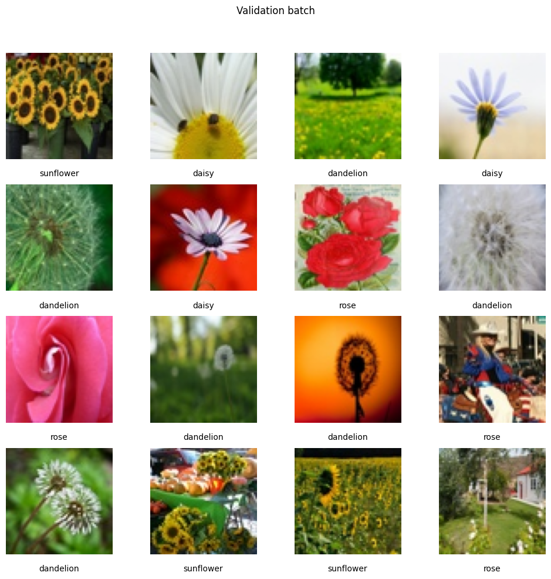
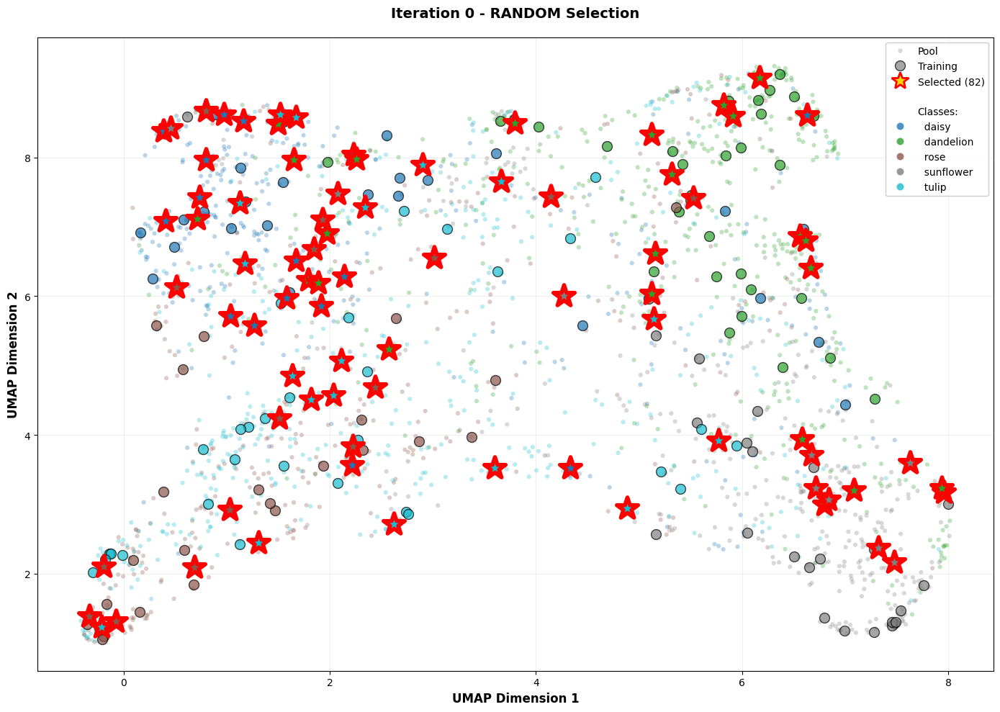

# Active Learning

<!--

Excalidraw:

```bash
# Log in/out to Docker Hub
docker logout
docker login

# Pull the official image (first time)
docker pull excalidraw/excalidraw

# Start app
docker run --rm -dit --name excalidraw -p 5001:80 excalidraw/excalidraw:latest
# Open browser at http://localhost:5001

# Stop
docker stop excalidraw
docker rm excalidraw
docker ps
```

Title: Does Active Learning Really Work in Deep Learning?
Subtitle: Not Always, But It Is Low-Cost and It Can Still Be An Educated Selection Framework
-->

<p align="center">

<small style="color:grey">
Some blueberries hanging from a branch waiting to be picked. Which ones would you choose?
Photo by <a href="https://unsplash.com/@m_mendez_ix">Mario Mendez</a> on <a href="https://unsplash.com/photos/blue-berries-in-tilt-shift-lens-fw7sKxSg5Vs">Unsplash</a>.</small>
</p>

Deep learning models typically require large amounts of labeled data to achieve good performance. However, every machine learning practitioner knows how difficult it is to achieve that. Even before dealing with the model definition, it is necessary to address two big requirements:

1. We need to set up a pipeline to get enough good-quality, representative data (randomized, unbiased, etc.). Ideally, we should be able to re-trigger that pipeline on demand; this is especially important if we suspect [data drift](https://en.wikipedia.org/wiki/Concept_drift) might occur (as it often does).
2. We have to annotate those obtained samples as efficiently as possible &mdash; and, as is well known, human labeling is tiresome, expensive, and error-prone.

[Active Learning](https://en.wikipedia.org/wiki/Active_learning_(machine_learning)) assumes the first step is given and it defines a framework to address the second one by using the model's own outputs.

> The main idea behind AL is to iteratively label only the most informative samples identified by the model itself. The underlying assumption is that this progressive training and labeling improves the model's performance faster than random sampling, which is the standard baseline for comparison &mdash; but, is that always the case?

In this blog post, you will learn:

- What some of the most popular Active Learning strategies are and how they work behind the scenes.
- How those techniques can be used via the library [`scikit-activeml`](https://github.com/scikit-activeml/scikit-activeml) without any further implementation.
- Some experiments with the [flowers dataset](https://www.kaggle.com/datasets/imsparsh/flowers-dataset) which evaluate the introduced methods. TLDR; random sampling performs surprisingly well compared to the other methods.

<div style="height: 20px;"></div>
<div align="center" style="border: 1px solid #e4f312ff; background-color: #fcd361b9; padding: 1em; border-radius: 6px;">
<strong>
You can find this post's accompanying code in <a href="https://github.com/mxagar/active_learning_guide">this GitHub repository</a>.
</strong>
</div>
<div style="height: 30px;"></div>

## Active Learning Strategies in a Nutshell

There are a plethora of methods under the umbrella of Active Learning (AL); in fact, AL is still a research topic, and new methods are constantly being proposed. The following papers classify and describe the most important ones so far:

- [Active Learning Literature Survey (Settles, 2010)](https://burrsettles.com/pub/settles.activelearning.pdf)
- [A Survey of Deep Active Learning (Ren et al., 2020)](https://arxiv.org/abs/2009.00236)

I won't try to write another survey here; instead, I prefer to focus on some practical methods I have worked with and which are available off-the-shelf in the library [`scikit-activeml`](https://github.com/scikit-activeml/scikit-activeml), which is one of the most widely used libraries for AL.

In general, AL methods try to iteratively identify the most informative samples from an unlabeled pool of data $U$.
We start by labeling a small subset of samples, which we call $L$, and train the model on them; that is our first iteration.
In each subsequent iteration, the model trained on the already labeled set $L$ runs inference on the samples in $U$ and we choose the ones expected to improve the model the most. Then, those samples are annotated and added to $L$, and the model is re-trained. This process continues until we reach a certain stopping criterion, e.g., a maximum number of iterations, a performance threshold, or when the model's performance plateaus.

<p align="center">

<small style="color:grey">Active Learning iteratively selects samples to be annotated from an unlabeled pool <i>U</i>. Then, these samples are labeled and added to the training set <i>L</i>. The right figure shows the process in action in a 2D embedding space. If you're not sure what embeddings are, check <a href="https://mikelsagardia.io/blog/diffusion-for-developers.html">this post of mine</a>. Image by the author.</small>
</p>

The selection strategy is key, and it can depend on several factors, but commonly the model outputs are part of the process. Considering a classification problem, the model typically outputs class probabilities $p(y_k|x)$ for a sample $x$, where $y_k \in \{1, ..., K\}$ is one of the $K$ classes.

Now, let's have a look at the aforementioned selection methods.

**Random Sampling** &mdash; This is the simplest selection strategy: we randomly select samples from the unlabeled pool $U$ to label; in other words, no model information is used. This serves as a *baseline* for comparison with more sophisticated methods. Mathematically, we can express it as

$$x^*= \text{Uniform}(U),$$

where $x^*$ is the selected sample and $\text{Uniform}(U)$ denotes a function that randomly selects a sample from the unlabeled pool $U$.

**Entropy-based Uncertainty Sampling** &mdash; The entropy of a prediction can be used to measure how confident a model is; if there is one clearly bigger class probability $p(y_k|x)$, the model is certain of its prediction, whereas more homogeneous $p(y_k|x)$ values denote uncertainty. The goal of this method is to select the samples with the highest uncertainty, so that the model can learn from them and become more confident. The entropy $H$ of a predicted sample $x$ is defined as 

$$H(x) = -\sum_{k=1}^K p(y_k|x) \log p(y_k|x).$$

Then, the next sample with the highest entropy is selected:

$$x^* = \arg\max_{x \in U} H(x).$$

In practice, all the unlabeled samples in $U$ are sorted according to their entropy value (descending), and the first $N$ are selected, where $N$ is the number of new samples we would like to add to the labeled set $L$.
This method is also known as *maximum entropy sampling*, and it is one of the most popular ones.

**Margin Sampling** &mdash; Instead of considering the whole distribution of class probabilities, margin sampling focuses on the difference between the two most probable classes. Let $p_1$ be the highest class probability for a sample $x$, that is,

$$p_1 = \max_{k} p(y_k|x),$$

and let $p_2$ be the second highest class probability. The margin is defined as the difference between these two probabilities:

$$M(x) = p_1 - p_2.$$

Then, the next sample with the smallest margin is selected, as it indicates that the model is uncertain between the top two classes:

$$x^* = \arg\min_{x \in U} M(x).$$

The idea is very similar to entropy-based sampling.

**Least Confident Sampling** &mdash; Least confident sampling selects the samples with the *lowest maximum predicted probabilities*; that is, first we compute the *least confident score* for a sample $x$ as

$$LC(x) = 1 - \max_{k} p(y_k|x).$$

Then, the next sample with the highest least confident score is selected:

$$x^* = \arg\max_{x \in U} LC(x).$$

Again, the idea is similar to the previous two methods, but it only considers the maximum predicted probability, which can be less informative than considering the whole distribution (entropy) or the top two probabilities (margin).

**[BADGE (Batch Active learning by Diverse Gradient Embeddings, by Ash et al., 2020)](https://arxiv.org/abs/1906.03671)** &mdash; The methods presented so far try to select the most uncertain samples, but they don't consider the diversity of the selected ones. In contrast, BADGE is a method that tries to select samples that are both *uncertain and diverse*. The intuitive reason why we'd like to consider *diversity* is that it seems sensible to cover different regions of the data distribution, not only the spots where the model is unsure. In order to achieve that, in addition to the predicted probabilities, BADGE requires the embedding or feature vectors of the penultimate layer of the model. I will not go into all the mathematical details here, but the main idea is the following:

- The labels of the samples in the unlabeled pool $U$ are estimated by the model: $\hat{y} = \arg\max_{k} p(y_k|x)$.
- The gradient of the last linear layer weights is computed for each sample in $U$ as if it were labeled with its estimated label $\hat{y}$; this gradient is called the *gradient embedding* of the sample. Let $h(x)$ be the function that yields the embedding of the penultimate layer for a sample $x$, and let's assume we are using a cross-entropy loss with a softmax activation; then, the gradient embedding $g(x)$ has this form:
  $$g(x) = h(x)(p-e_{\hat{y}})^T,$$
  being $e_{\hat{y}}$ the one-hot encoded vector corresponding to the estimated label $\hat{y}$. This *gradient embedding* $g(x)$ is of shape $(d \times K)$, where $d$ is the dimension of the penultimate layer's output (embedding size) and $K$ is the number of classes. It is a tensor that represents the direction and magnitude of the parameter update that labeling this sample would induce and it captures information related to both uncertainty and diversity.
- Then, the [K-means++](https://en.wikipedia.org/wiki/K-means%2B%2B) initialization procedure is applied to the gradient embeddings of the samples in $U$. This procedure iteratively selects samples that are far from the already selected ones in the gradient embedding space. The selected samples correspond to well-separated points in that space, which approximates selecting cluster centers without running the full [k-means](https://en.wikipedia.org/wiki/K-means_clustering) clustering algorithm. This way, we select samples that are both uncertain (as they tend to have large gradient norms) and diverse (as their gradient embeddings are spread across the space).

## Implementation with Scikit ActiveML

I have prepared a [GitHub repository](https://github.com/mxagar/active_learning_guide) which contains a mini-project that implements the above methods and runs some experiments with the [Kaggle Flowers Dataset](https://www.kaggle.com/datasets/imsparsh/flowers-dataset) (classification of 5 types of flowers).

As explained in the [repository's README](https://github.com/mxagar/active_learning_guide/blob/main/README.md), the project is structured as follows:

- [`active_learning.ipynb`](./active_learning.ipynb): main notebook with the active learning loop and experiments. This is the entry point for the user to learn about AL interactively. The notebook uses three helper modules, listed below.
- [`model_utils.py`](./model_utils.py): model definition and training/evaluation functions. It contains:
    - `TrainConfig`: `dataclass` which defines the training hyperparameters.
    - `SimpleCNN`: simple convolutional neural network (CNN) with 2.2 million parameters for image classification.
    - `save_model` and `load_model`: utility functions to save and load the model weights.
    - `train_one_epoch` and `train`: functions to train the model for one epoch or multiple epochs, respectively.
    - `validate` and `evaluate`: functions to evaluate the model on a validation or test set, respectively.
    - `plot_history`: function to plot the training history (loss and accuracy curves).
    - `predict` and `predict_image`: functions to run inference with the model and get the predicted class probabilities, either for a batch of samples or for a single image.
- [`data_utils.py`](./data_utils.py): data processing functions, e.g., loading the dataset and creating the initial labeled/unlabeled splits.
    - `build_paths_and_labels`: function to build the file paths and labels from the dataset directory structure.
    - `CustomDataset`: custom PyTorch dataset class that loads the images and applies transformations.
    - `train_test_val_pool_split`: function to split the dataset into training, validation, and pool sets, and to create the initial labeled set for active learning.
    - `visualize_batch`: function to visualize a batch of images with their labels.
    - `train_transform` and `eval_transform`: data augmentation and preprocessing transformations for training and evaluation, respectively.
- [`active_ml_utils.py`](./active_ml_utils.py): active learning functions, e.g., computing the next candidates to label.
    - **`TorchClassifierWrapper`: wrapper class that adapts a PyTorch model to the `scikit-activeml` API, allowing us to use the query strategies with our model.**
    - **`compute_next_candidates`: function that computes the next samples to label based on the selected query/search strategy (`"random", "least_confident", "margin_sampling", "entropy", "badge"`).**
    - **`transfer_candidates_idx`: function to transfer the indices of the selected candidates to the main dataset.**
    - `plot_embeddings_2d`: function to plot the 2D UMAP embeddings of the samples, colored by several criteria.
    - `evaluate_active_learning`: function to benchmark different AL techniques, which runs the AL loop for each technique and collects the performance metrics for comparison.

The AL selection is implemented in the function `compute_next_candidates`, which is called in the main notebook `active_learning.ipynb` at each iteration of the AL loop. The function takes as input the current model, the pool of unlabeled samples, and the selected query strategy, and returns the indices of the samples to label next. Then, these indices are transferred to the main dataset using the function `transfer_candidates_idx`, which updates the labeled and unlabeled sets accordingly. A key component in this process is the `TorchClassifierWrapper`, which adapts a PyTorch model to be used for active learning.

<div style="height: 20px;"></div>
<p align="center">── ◆ ──</p>
<div style="height: 20px;"></div>

The library used to run all the aforementioned AL methods (and more) is the commonly used [`scikit-activeml`](https://github.com/scikit-activeml/scikit-activeml), which follows the [Scikit-Learn](https://scikit-learn.org/) API conventions. It requires us to define a query strategy, which is a class that implements the logic for selecting the most informative samples to label. Then, we pass the dataset and the classifier to the query:

```python
# Instantiate a query strategy, e.g., an entropy-based uncertainty sampling in this case.
# This computes the entropy (E=-sum(plog(p))) from the class probabilities
# and selects the samples with the highest entropy,
# i.e., the most uncertain predictions.
query_strategy = UncertaintySampling(
    method="entropy",
    ...
)

# Query the strategy for the next samples to label
query_idx = query_strategy.query(X, y, clf=my_classifier)
```

Here, the inputs & outputs are:

- `X` = feature matrix, usually of shape `(n_samples, n_features)`
- `y` = labels with `-1` for unlabeled samples
- `clf` = some classifier model that *has* the method `predict_proba(X)`
- `query_idx` = indices of the samples to label next

Therefore, we need to adapt our setup to fit this API.

Note that there are other query strategies, too:

- Random: `RandomSampling(...)`
- Margin Sampling: `UncertaintySampling(method="margin_sampling", ...)`
- Least Confidence: `UncertaintySampling(method="least_confident", ...)`
- BADGE: `Badge(...)`
- And many more!

In the provided code, the adaptation of the PyTorch-based classifier is handled by `TorchClassifierWrapper`:

- During the instantiation of `TorchClassifierWrapper`, we pass a PyTorch `CustomDataset` containing references to all the unlabeled samples in the pool. In addition, we provide the trained PyTorch model.
- Internally, `TorchClassifierWrapper` creates a PyTorch `DataLoader` for the `CustomDataset`, which expects a list of sample indices to load; this list corresponds exactly to the input vector `X`, which no longer contains the sample features themselves.
- It also implements the method `predict_proba(X)`, which runs the `DataLoader` on the indices passed in `X`, calls the PyTorch model, and outputs the model predictions (class probabilities, and optionally embeddings when required by the query strategy, e.g., BADGE).

:point_right: Check [`TorchClassifierWrapper` in `active_ml_utils.py`](https://github.com/mxagar/active_learning_guide/blob/main/active_ml_utils.py#L41).

```python
# https://github.com/mxagar/active_learning_guide/blob/main/active_ml_utils.py#L41
class TorchClassifierWrapper(SkactivemlClassifier):
    def __init__(
        self,
        model: torch.nn.Module,
        pool_ds: CustomDataset,
        batch_size: int = 16,
        missing_label: int = MISSING_LABEL_INT,
        classes: Optional[np.ndarray] = None,
        device: Optional[str | torch.device] = None,
        num_workers: int = 0,
        pin_memory: bool = False,
        random_state: Optional[int] = None,
        verbose: bool = False,
    ):
        ...
```

With the adaptation provided by `TorchClassifierWrapper`, we can now use the `scikit-activeml` query strategies with our PyTorch model. The function `compute_next_candidates` implements the logic to compute the next samples to label based on the selected query strategy and `transfer_candidates_idx` handles the transfer of the selected candidate indices to the main/training dataset, updating the labeled and unlabeled sets accordingly:

:point_right: Check [`compute_next_candidates` in `active_ml_utils.py`](https://github.com/mxagar/active_learning_guide/blob/main/active_ml_utils.py#L163).

:point_right: Check [`transfer_candidates_idx` in `active_ml_utils.py`](https://github.com/mxagar/active_learning_guide/blob/main/active_ml_utils.py#L253).


```python
# https://github.com/mxagar/active_learning_guide/blob/main/active_ml_utils.py#L163
def compute_next_candidates(
    model: torch.nn.Module,
    pool_ds: CustomDataset,
    query_size: int,
    method: SearchStrategy = "entropy",
    seed: int = 42,
    batch_size: int = 128,
    classes: Optional[np.ndarray] = None,
    missing_label: int = -1,
    device: Optional[torch.device | str] = None,
    num_workers: int = 0,
    pin_memory: bool = True,
    verbose: bool = False,
) -> list[int]:
    ...

# https://github.com/mxagar/active_learning_guide/blob/main/active_ml_utils.py#L253
def transfer_candidates_idx(
    train_idx: list[int],
    pool_idx: list[int],
    candidates_idx: np.ndarray | list[int],
) -> tuple[list[int], list[int], list[int]]:
    ...
```

## Experiments

In the final section of [`active_learning.ipynb`](https://github.com/mxagar/active_learning_guide/blob/main/active_learning.ipynb) I implemented two functions:

- `evaluate_active_learning` runs the AL loop for a selected method, iteratively selecting new samples and re-training the model,
- and `run_multiple_experiments` calls that function for several AL methods and collects the resulting performance metrics for comparison.

With them, I have conducted experiments to benchmark the AL selection methods introduced in previous sections: I have measured how the performance of a classifier evolves as more samples are iteratively added to the training set, simulating the typical AL process.

As already introduced, I have used the [Kaggle Flowers Dataset](https://www.kaggle.com/datasets/imsparsh/flowers-dataset), with the following experimental setup:

- Task: classification of 5 types of flowers (daisy, dandelion, rose, sunflower, and tulip).
- Input images: resized to 64x64x3 pixels for faster training; random affine transformations are applied to the training split for data augmentation.
- Model: a simple, non-pretrained convolutional neural network (CNN) with 2.2 million parameters.
- Training hyperparameters: 30 epochs per AL iteration; batch size of 64; learning rate of 0.001; AdamW optimizer and validation F1 as the main performance decision metric.
- Initial training set (iteration 0): 137 samples; initial labeled data used to train the first model.
- Validation set: 276 samples; kept fixed across iterations to evaluate the model's performance during training.
- Test set: 276 samples; kept fixed across iterations to evaluate the final performance of the model after each AL iteration.
- Pool set: 2057 samples; *"unlabeled"* samples available for selection.
- Query size: 3% of the total dataset size (2746 samples), which corresponds to 82 samples. At each iteration, we select 82 new samples from the pool to label and add to the training set.
- Max AL iterations: 20, which means that at most 1640 samples will be labeled and added to the training set by the end of the AL process.
- Tested AL methods: random sampling, maximum entropy sampling, least confident sampling, margin sampling, and BADGE.

Of course, even though the pool samples are considered *"unlabeled"* during the AL process, they are actually labeled in the dataset, which allows us to evaluate the model's selection behavior offline.

<p align="center">

<small style="color:grey">
A validation batch of flower images from the <a href="https://www.kaggle.com/datasets/imsparsh/flowers-dataset">Kaggle Flowers Dataset</a>. The dataset contains 5 classes of flowers: daisy, dandelion, rose, sunflower, and tulip. The images are resized to 64x64x3 pixels for faster training.
</small>
</p>

The experiment for each AL method follows the same iterative procedure. At iteration $t \in \{0, ..., 19\}$:

- We train a model from scratch using the current training set.
- We evaluate the model on the test set.
- We select new samples from the pool using the chosen query/selection strategy.
- We move the selected samples from the pool to the training set.

This process is repeated until a stopping criterion is met: either the maximum number of iterations is reached (20), or the pool becomes empty.

Note that the model is re-trained from scratch at every iteration. This avoids bias introduced by incremental fine-tuning and ensures that performance only depends on the current training set.

The following figure shows the embeddings of the flower image samples at the initial iteration (iteration $t=0$); this initial iteration is identical for all methods and the model is trained with 137 samples for 30 epochs.

<p align="center">

<small style="color:grey">
Embeddings of flower images from the <a href="https://www.kaggle.com/datasets/imsparsh/flowers-dataset">Kaggle Flowers Dataset</a>. The embeddings are obtained from the penultimate layer of the <i>SimpleCNN</i> model and mapped to 2D using <a href="https://umap-learn.readthedocs.io/en/latest/">UMAP</a>. Each point represents an image, colors indicate different classes, and point geometries represent the sample status: small transparent circles for unlabeled samples, bigger opaque circles for labeled ones, and stars for selected ones. This snapshot corresponds to the initial iteration (137 samples, 30 epochs), which is identical for all methods.
</small>
</p>

### A Surprising Result

After running the experiments for the 5 AL methods in 20 iterations (from 137 to 1777 training samples), here are the model performance values:

<p align="center">

<small style="color:grey">
Performance comparison of different active learning methods: random sampling, maximum entropy sampling, least confident sampling, margin sampling, and BADGE. The X-axis shows the number of labeled samples, and the Y-axis shows the model's F1 on the test set. In this case, random sampling performs surprisingly well, while the other methods do not show significant improvements over random sampling.
</small>
</p>

Deceiving, isn't it? It seems that there is no difference between the AL methods and the baseline: random sampling. So what is all the fuss about?

At this point, several questions about the experimental setup naturally arise:

- Are the sizes well chosen? That is: the dataset size, the initial training set size, the query size, and the number of iterations.
- Is the task well chosen? That is: image size, classification difficulty, training hyperparameters, etc.
- The task may simply be too easy (e.g., very distinct class images): If the model can quickly learn the task with a small number of labeled samples, then active learning might not provide significant benefits over random sampling, because almost any sample provides useful information to the model.
- The model's uncertainty estimates might not be reliable, especially in the early stages of training when the model is not well-calibrated.
- The data distribution might be such that the most uncertain samples are not actually the most informative ones for improving the model's performance.
- The model might be relatively strong and high-capacity, learning the task well even with random sampling, thus reducing the potential benefits of active learning.
- On simple tasks, AL methods converge to random sampling, as the model quickly learns the task and all samples become equally informative.
- There may be high data redundancy: if the dataset is already well clustered, random sampling may already spread across clusters.
- ...

And all of them are fair and worth investigating. However, that doesn't change the fact that **boosting our training performance with AL techniques is not straightforward**. In fact, similar effects have already been observed in the literature, especially in deep learning settings, where random sampling is often surprisingly competitive [(Ren et al., 2020)](https://arxiv.org/abs/2009.00236).

I personally have applied AL several times and I was not sure whether it really provided a significant boost in performance compared to random sampling. It is indeed difficult to evaluate that, because we usually don't have the labels. However, my bottom line is the following:

> Although AL techniques are designed to select the most informative samples, they don't always outperform random sampling in practice, especially in deep learning settings. 
However, using AL techniques can still provide a reasonable heuristic, and they are rather easy to implement and integrate into the training pipeline.

## Conclusions

In this post I have introduced what [Active Learning (AL)](https://en.wikipedia.org/wiki/Active_learning_(machine_learning)) is, focusing on some of the most popular AL selection strategies: random sampling, maximum entropy sampling, least confident sampling, margin sampling, and BADGE. I have also shown how to implement those techniques using the library [`scikit-activeml`](https://github.com/scikit-activeml/scikit-activeml) and how to adapt a PyTorch model to be used with it. Finally, I have run some experiments with the [Kaggle Flowers Dataset](https://www.kaggle.com/datasets/imsparsh/flowers-dataset) to evaluate the performance of the mentioned AL methods &mdash; to end up showing that random sampling performs surprisingly well compared to the other methods!

> What's your experience with active learning? Do you think it provides a significant boost in performance compared to random sampling? What's missing in my experimental setup to show that it really outperforms random sampling?


